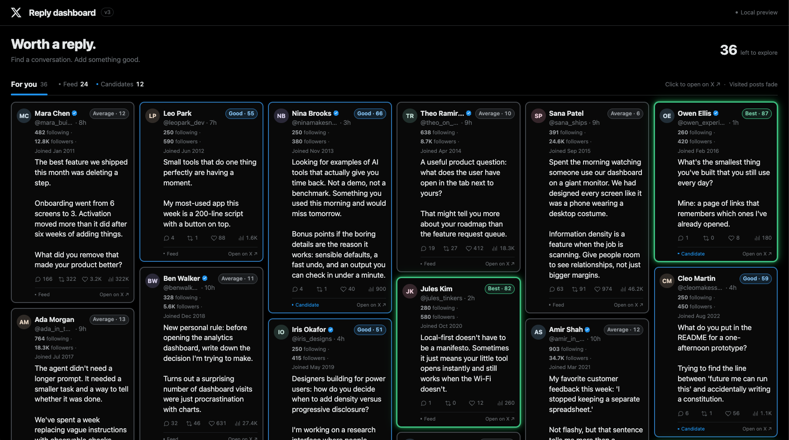

A **read-only**, X-dark React component library for scanning posts worth replying to. Transparent opportunity scoring, round-robin column stacks that **preserve card width** (`minCardWidth` default **400**, `maxColumns` **8**), local visited state, and zero write actions against X.

**Package:** `@rickgorman/x-reply-opportunity-grid`
**Peers:** `react` + `react-dom` (18 or 19)
**Hard gate:** display-only. Opens x.com in a new tab. Never follow, like, reply, or DM.

---

## Install (private GitHub)

Use Node.js **22.12+** (Node 20.19+ is also supported), Git, and access to this private repository. Authenticate Git with GitHub using your credential manager or SSH key before installing; npm registry authentication alone does not grant repository access.

Install from the React package branch in your application. Choose one package manager:

| Package manager | Install |
|---|---|
| npm | `npm install "github:rickgorman/x-reply-opportunity-grid#feat/react-package"` |
| pnpm | `pnpm add "github:rickgorman/x-reply-opportunity-grid#feat/react-package"` |
| Yarn | `yarn add "github:rickgorman/x-reply-opportunity-grid#feat/react-package"` |
| Bun | `bun add "github:rickgorman/x-reply-opportunity-grid#feat/react-package"` |

An explicit HTTPS dependency URL is `git+https://github.com/rickgorman/x-reply-opportunity-grid.git#feat/react-package`; for SSH, use `git+ssh://git@github.com/rickgorman/x-reply-opportunity-grid.git#feat/react-package`. Replace the branch after `#` with a full commit SHA to pin a specific build, and commit your application's lockfile. These instructions use GitHub distribution; the package name alone is not an npm registry installation instruction.

### Peer dependencies

React and React DOM are provided by your application and are not bundled:

| Package | Supported range |
|---|---|
| `react` | `^18.2.0 || ^19.0.0` |
| `react-dom` | `^18.2.0 || ^19.0.0` |

If your app does not already have them, install a matching pair using `npm install react@^19 react-dom@^19`, `pnpm add react@^19 react-dom@^19`, `yarn add react@^19 react-dom@^19`, or `bun add react@^19 react-dom@^19`. TypeScript apps also need matching `@types/react` and `@types/react-dom` as development dependencies. Existing React 18.2+ apps can keep React 18.

## Usage

```tsx
import { ReplyOpportunityGrid, type Tweet } from "@rickgorman/x-reply-opportunity-grid";
import "@rickgorman/x-reply-opportunity-grid/styles.css";

export function Feed({ tweets }: { tweets: readonly Tweet[] }) {
  return <ReplyOpportunityGrid tweets={tweets} />;
}
```

Import the CSS once in your application's entry point or global stylesheet entry. The JavaScript entry does not load it automatically. Supply your own `Tweet[]`: keep IDs as strings, handles without `@`, `source` as `"feed"` or `"candidate"`, and timestamps in ISO format. The package does not fetch posts or require X credentials.

### Package contents and module formats

Git installs use the **committed `dist/` output**. There is no `prepare` script and consumers do not need to build this repository or install its development tools. The package includes `dist/`, this README, the preview image, and `package.json`; the Vite demo, fixtures, tests, and legacy app are not included.

| Public entry | Resolved output |
|---|---|
| `import … from "@rickgorman/x-reply-opportunity-grid"` | ESM: `dist/index.js`, types: `dist/index.d.ts` |
| `require("@rickgorman/x-reply-opportunity-grid")` | CommonJS: `dist/index.cjs`, types: `dist/index.d.cts` |
| `@rickgorman/x-reply-opportunity-grid/styles.css` | `dist/styles.css` |

Source maps are included for both JavaScript formats. Use the public entries above; internal `src/` and `dist/` subpaths are not exported. CSS is marked as a side effect so bundlers retain its explicit import. Both JavaScript bundles carry `"use client"` for React frameworks with server components; load the stylesheet where your framework permits global CSS.

## Public API

| Export | Kind | Purpose |
|---|---|---|
| `ReplyOpportunityGrid` | React component | Column grid of opportunity cards |
| `scoreReplyOpportunity(tweet, opts?)` | Pure function | Score + label + explanation |
| stylesheet import `.../styles.css` | CSS | Scoped under `.x-reply-opportunity-grid` |
| Types + layout helpers | — | `Tweet`, `columnCountForWidth`, `DEFAULT_MIN_CARD_WIDTH`, … |

## ReplyOpportunityGrid options

| Name | Type | Default | Effect |
|---|---|---|---|
| `tweets` | `readonly Tweet[]` | required | Cards to render. Input order preserved (no score sort). First duplicate id wins. |
| `scoreOptions` | `ScoreOptions` | `{}` | Forwarded to the scorer. |
| `minCardWidth` | `number` | `400` | Preferred card floor in CSS px. **Column count drops before cards crush under this width.** Ignored when `breakpoints` is set. |
| `gridGap` | `number` | `12` | Gap used by min-width fitting. |
| `mainInlinePad` | `number` | `56` | Assumed horizontal chrome outside the grid when fitting. |
| `maxColumns` | `number` | `8` | Cap when using min-card-width fitting. |
| `breakpoints` | `readonly ColumnBreakpoint[]` | unset | Legacy `{ minWidth, columns }` table; replaces min-card-width fitting when set. |
| `storageKey` | `string | null` | `x-reply-visited` | localStorage key; `null` disables persistence. |
| `previewLines` | `number` | `12` | Collapsed body line budget before Show more. |
| `className` | `string` | — | Extra root class. |
| `style` | `CSSProperties` | — | Root inline style. |
| `id` | `string` | — | Root DOM id. |
| `ariaLabel` | `string` | Tweets worth replying to | Region name. |
| `emptyState` | `ReactNode` | No posts to explore yet. | Empty content. |
| `onVisitedChange` | `(ids) => void` | — | Visited IDs from current tweets (input order). |

## Layout and minCardWidth

Default behavior fits as many columns as possible without cards going under `minCardWidth` (400px):

```text
available = viewportWidth - mainInlinePad
columns   = clamp(1..maxColumns, floor((available + gridGap) / (minCardWidth + gridGap)))
```

Cards keep a 400px floor (or the available width on smaller screens); the grid drops columns as the viewport shrinks. Default column counts are 2200→5 · 2560→6 · 3440→8. Account details use the full body width below the author row, with Joined staying on the same line and ellipsizing only when needed. Round-robin placement keeps source order (index i goes to column i % columns).

Legacy breakpoints (only when you pass `breakpoints`): 2200→7 · 1800→6 · 1500→5 · 1200→4 · 900→3 · 600→2 · 0→1.

## Scoring

Pure function `scoreReplyOpportunity(tweet, opts?)`. No DOM or storage.

```text
P = min(1, f/peerMin, peerMax/max(f,1))
F = min(1, g/max(f, followingFloor))
R = 1/(1+r/replyHalf); L = 1/(1+l/likeHalf); V = 1/(1+v/viewHalf)
I = min(1, matchedBioWeight/bioWeightForFull)
A = 1/(1+h/freshnessHalfLifeHours)
score = round((wP*P + wF*F + wR*R + wL*L + wV*V + wI*I) * A)
```

Defaults: weights {32, 8, 24, 9.6, 6.4, 20}, peer [100,2000], followingFloor 240, room half-lives {5,50,1000}, bio full weight 6, freshness half-life **24h**.

**Tiers only three — no Elevated:** Best ≥70 emerald + neon glow; Good ≥50 sky; Average gray.

### ScoreOptions

| Name | Type | Default | Effect |
|---|---|---|---|
| `now` | `number` | `Date.now()` | Epoch ms for age/freshness |
| `weights` | `Partial<ScoreWeights>` | defaults | Partial overrides; normalized to 100 |
| `thresholds` | `Partial<{best,good}>` | `{best:70,good:50}` | Label cutoffs |
| `lexicon` | `Record<string, number>` | bundled | Bio token weights |
| `freshnessHalfLifeHours` | `number` | `24` | Age where freshness is 0.5 |
| `peerFollowerRange` | `[min,max]` | `[100,2000]` | Peer-fit band |
| `followingFloor` | `number` | `240` | Following signal denominator floor |
| `roomHalfLives` | `Partial<{replies,likes,views}>` | `{5,50,1000}` | Room half-lives |
| `bioWeightForFullScore` | `number` | `6` | Bio weight that saturates interest |

## Theming

Import the stylesheet once. Rules are scoped under `.x-reply-opportunity-grid`. Override `--xrog-text`, `--xrog-muted`, `--xrog-accent`, `--xrog-card-background`, `--xrog-hover-background`, `--xrog-best-edge`, `--xrog-good-edge`, `--xrog-average-edge`, `--xrog-gap`, `--xrog-radius`.

## Visited state

Stored in localStorage under `storageKey` (default `x-reply-visited`) as `{ [tweetId]: ISO timestamp }`. Opening a card marks it visited and grays it. `storageKey={null}` keeps marks in memory only. Cross-tab sync via storage events.

## Accessibility

Named region, score chip with full explanation as aria-label, metric text alternatives, real expand button with aria-expanded, focus rings, prefers-reduced-motion.

## Read-only gate

This package never posts, replies, likes, reposts, follows, or DMs. It only renders tweets you pass in, scores them locally, and opens `https://x.com/{handle}/status/{id}` with `rel=noopener noreferrer`.

## Vite demo (repository checkout)

Clone the repository to run the demo; it is not shipped in the consumer package. Use the Node.js version and GitHub access described above:

```sh
git clone --branch feat/react-package https://github.com/rickgorman/x-reply-opportunity-grid.git
cd x-reply-opportunity-grid
```

From the repository root, choose one row and run its install command followed by its dev command:

| Package manager | Install dependencies | Start Vite |
|---|---|---|
| npm | `npm ci` | `npm run dev` |
| pnpm | `pnpm install` | `pnpm dev` |
| Yarn | `yarn install` | `yarn dev` |
| Bun | `bun install` | `bun run dev` |

Open **http://127.0.0.1:5173**. Vite uses a strict port: if 5173 is occupied, stop the conflicting server or pass `--port 5174` to your dev command. Stop Vite with Ctrl+C. The repository tracks `package-lock.json`; npm uses that lockfile, while other managers resolve dependencies and create their own lockfiles.

The demo imports the library source directly, so no library build is required before starting it. It uses `fixtures/tweets.json` with a fixed clock (`2026-09-08T18:00:00Z`) so fictional tiers stay stable. The page opens with the compact controls and grid, without a marketing heading.

## Building and checking the package

Run these from the repository root after installing dependencies:

```sh
npm run typecheck
npm test
npm run build
npm run build:demo
npm pack --dry-run
```

For pnpm, Yarn, or Bun, use `pnpm run <script>`, `yarn run <script>`, or `bun run <script>` for the same package scripts. `test:watch` runs Vitest interactively.

`build` recreates `dist/` with ESM, CommonJS, declarations, source maps, and CSS. **Commit the rebuilt `dist/` alongside every library source change** so GitHub consumers receive matching output. `build:demo` produces the standalone demo in `demo-dist/`, which stays ignored. `npm pack --dry-run` lists the consumer package contents; it does not rebuild them. `prepublishOnly` runs typecheck, tests, and the library build when publishing, but does not run for a normal Git install or `npm pack`.

To try the packaged files in another local app, run `npm pack` here, then run `npm install /absolute/path/to/rickgorman-x-reply-opportunity-grid-0.1.0.tgz` in that app (or use your manager's `add` command). Install the React peers there as described above. The tarball contains the current `dist/`, so build first.

## For agents — file map

```text
src/           library (index, types, scoring, layout, grid, hooks, styles, lexicon, tests)
demo/          Vite app (index.html, main.tsx, styles.css, vite.config.ts)
fixtures/      tweets.json, interest-lexicon.json, index.ts
docs/          dashboard-preview.png (README hero)
legacy/vanilla-snapshot/  original vanilla app.js / styles.css / data
package.json   name @rickgorman/x-reply-opportunity-grid
tsup.config.ts / vitest.config.ts / tsconfig.json
BRIEF-react-package.md
```

Vanilla history lives under `legacy/vanilla-snapshot/`. Prefer `src/` for product changes.
